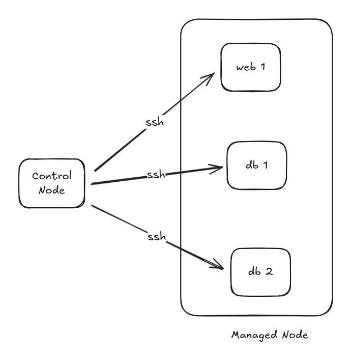
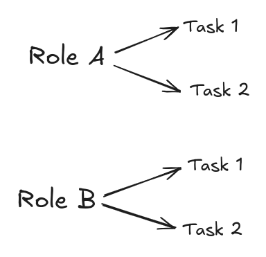
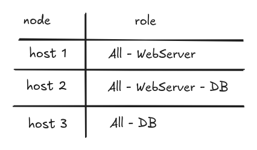

# انسیبل چیه و چطور کار میکند
## مقدمه و هدف
این داکیومنت یک دید اولیه میدهد در مورد اینکه انسیبل چیست و چه کاری انجام میدهد.

## توضیح موضوع
## انسیبل چیست؟
انسیبل فقط کافیست روی یک هاست لینوکسی نصب شود و با پروتکل SSH میتواند به هاست های مورد نظر وصل شود و تغیرات خواسته شده رو اعمال کنه و انسیبل Agent less هست یعنی بدون نیاز به نصب چیزی اضافه تر روی هاست میتواند عملیات مورد نظر رو انجام دهد.



همینطور که در تصویر میبینید انسیبل روی یک ماشین نصب می‌شود و بهش `Control Node` میگیم که این میتونه هرچیزی باشه. این ماشین خودش به سرورهای دیگر وصل میشه تا کارهایی انجام بده.

به اون سرور هایی که متصل میشود به اونها `Managed Node` میگیم. به زبان خیلی راحت تر هر ماشینی که توسط انسیبل مدیریت میشود `Managed Node` هستش.

همچنین در `Managed Node` ها هیچ نیازی به  نصب انسیبل نداریم.


توصیه میشود برای متصل شدن به سرور های مورد نظر حتما `Public Key` ماشین `Control Node` روی سرور ها قرار دهیم که برای وصل شدن نیازی به وارد کردن پسورد نداشته باشیم.

نحو کار کردن انسیبل بصورت خلاصه :
فایل های `tml.` تبدیل به `python` میشود و روی سرور ها گذاشته میشود و اون ها اجرا میشود.

**نکته**
انسیبل یک ابزار portable هست، یعنی مهم نیست کجا نصب باشه هرجایی که نصب کنیم میتوانیم عملیات های مورد نظرمون رو اجرا کنیم.

داخل انسیبل یک سری Role مشخص میکنیم که داخل آن یک سری تسک هستند.



و همچنین یک سری Host داریم که خودمون بر اساس منطق خودمون دسته بندی کردین:



توی عکس بالا هر host مون میتونه جزو یک یا چند گروه باشه. 

```
Role -> Task -> host Category
```

منطق انسیبل به این صورت هست که یک سری Role داریم که یک Task را روی یک سری host مشخص انجام میدهد.

مثلا میگیم `Role A` و `Role B` را روی `WebServer` اجرا کن.

## بهترین ساختار پوشه برای انسیبل
انسیبل خودش یک سری Best Practice هایی دارد که بر اساس اون ساختار پوشه بندی رو رعایت میکنیم.

دایرکتوری اصلی :
داخل این دایرکتوری تمام تنظیمات رو قرار میدهیم : `ansible_project` 
```bash
➜  ansible tree .                   
.
├── group_vars 
├── host_vars
├── inventory
├── playbook
└── roles
    ├── default
    │   └── main.yml
    ├── files
    │   └── main.yml
    ├── handlers
    │   └── main.yml
    ├── tasks
    │   └── main.yml
    ├── templates
    └── vars
        └── main.yml
```

دایرکتوری اصلی: `ansible_project`  
محلی که کل تنظیمات، نقش‌ها و فایل‌های مربوط به اجرای Playbookها را کنار هم نگه می‌دارد.

پوشه‌های اصلی:

**group_vars**  
متغیرهایی که مخصوص یک گروه از سرورها هستند.

**host_vars**  
متغیرهایی که فقط برای یک سرور مشخص تعریف می‌شوند.

**inventory**  
لیست سرورها و گروه‌بندی آن‌ها برای اجرای Playbook.

**playbook**  
فایل‌های اصلی اجرا که مشخص می‌کنند چه کاری روی چه سروری انجام شود.

**roles**  
ساختار ماژولار برای سازمان‌دهی وظایف و فایل‌ها در یک بسته قابل‌استفاده.

و داخل `roles` هر پوشه چه نقشی دارد:

**roles/default/main.yml**  
تعریف متغیرهای پیش‌فرض.

**roles/files/**  
فایل‌هایی که باید مستقیماً روی سرور کپی شوند.

**roles/handlers/main.yml**  
وظایفی که در پاسخ به تغییرات تریگر می‌شوند، مثل ری‌استارت سرویس‌ها.

**roles/tasks/main.yml**  
لیست اصلی کارهایی که این نقش انجام می‌دهد.

**roles/templates/**  
فایل‌های template مثل Jinja2 که با متغیرها جایگذاری می‌شوند.

**roles/vars/main.yml**  
متغیرهای ثابت و خاص این نقش.


این ساختار Best Practice انسیبل هست اجباری برای استفاده از این نیست.
## جمع‌بندی
### انسیبل چیه و چطور کار می‌کند؟
انسیبل یه ابزار اتوماسیون ساده و بدون Agent هست که فقط روی یک ماشین نصب میشه؛ به اون ماشین میگیم **Control Node**. همین ماشین با SSH به سرورها وصل میشه و کارها رو انجام میده. اون سرورها هم میشن **Managed Node** و هیچ نیازی نیست انسیبل روشون نصب باشه.

کار انسیبل اینه که فایل‌های YAML که نوشتیم رو تبدیل می‌کنه به کد پایتون و روی سرور اجراشون می‌کنه. برای راحتی هم بهتره با Public Key وصل بشیم که دردسر پسورد نداشته باشیم.

منطق کلیش هم ساده‌ست:  
ساختار **Role**‌ ها شامل **Task**‌ها هستن و این تسک‌ها روی یک سری **host** یا گروه از hostها اجرا میشن. مثلا میگیم Role وب‌سرور رو روی گروه WebServer اجرا کن.

برای نظم بیشتر هم یه ساختار پوشه Best Practice داره شامل:  
inventory برای لیست سرورها،  
group_vars و host_vars برای متغیرها،  
playbook برای دستور اصلی،  
و roles برای تعریف کارهای ماژولار.

در کل، انسیبل قابل حمله، ساده‌ست، SSH-based هست و خیلی راحت روی هر ماشینی میشه ازش استفاده کرد. ادامه مسیر هم ساخت Playbookها و Roleهای تمیزه که از دل همین ساختار درمیاد.
## منابع
[دوره انسیبل مرتضی باشسیز](https://youtu.be/sR-x1QuhBnQ?si=BIF8mKKeXaCIeK9J)